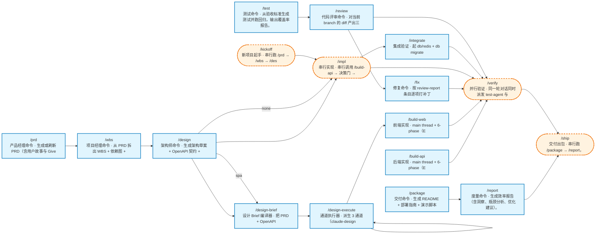

# DDT 命令依赖图

> v0.9 A1：从 `commands/*.md` 自动派生（frontmatter description + 建议下一步段落）。
> 重新生成：`node bin/render-flowchart.mjs --output <path>`

## 节点形状说明

- `phase` 类（蓝色矩形）：单一职责的开发阶段命令
- `orch` 类（橙色虚线圆角）：编排命令，串/并行调下游 phase 命令
- `utility` 类（doctor / preview / relay / resume）不在本图（无 phase 关系）
