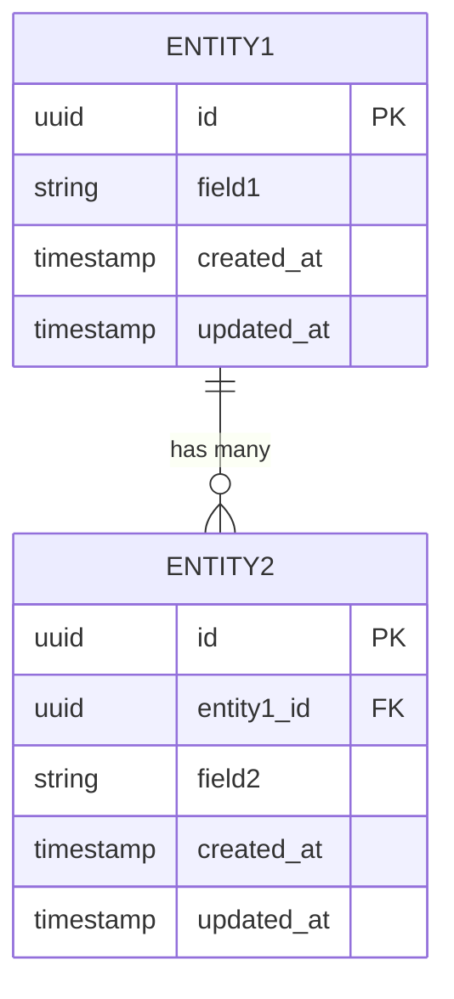

# 数据模型 · <项目名称>

> 版本：v1.0 · 作者：architect-agent · 日期：<YYYY-MM-DD>

---

## 核心实体

### <Entity1>

| 字段名 | 类型 | 约束 | 索引 | 说明 |
|-------|------|------|------|------|
| id | UUID | PK, NOT NULL | 主键 | 主键 |
| created_at | TIMESTAMP WITH TIME ZONE | NOT NULL | — | 创建时间 |
| updated_at | TIMESTAMP WITH TIME ZONE | NOT NULL | — | 更新时间 |
| <field1> | VARCHAR(255) | NOT NULL | — | <说明> |
| <field2> | <type> | NULL | <idx?> | <说明> |

### <Entity2>

| 字段名 | 类型 | 约束 | 索引 | 说明 |
|-------|------|------|------|------|
| id | UUID | PK, NOT NULL | 主键 | 主键 |
| <entity1_id> | UUID | FK → Entity1.id, NOT NULL | 外键索引 | 关联 Entity1 |
| created_at | TIMESTAMP WITH TIME ZONE | NOT NULL | — | 创建时间 |
| updated_at | TIMESTAMP WITH TIME ZONE | NOT NULL | — | 更新时间 |

---

## ER 图（Mermaid）

---

## 事务边界

| 操作 | 涉及实体 | 隔离级别 | 说明 |
|------|---------|---------|------|
| <创建操作> | Entity1, Entity2 | READ COMMITTED | <原因> |
| <扣减/更新操作> | Entity1 | SERIALIZABLE | 高并发写场景防止超卖 |

## 并发控制策略

- **乐观锁**：`version` 字段，适用于低竞争场景（读多写少）
- **悲观锁**：`SELECT FOR UPDATE`，适用于高竞争场景（如库存扣减）
- **幂等键**：`idempotency_key` 字段，防止网络重试导致重复写入

## 索引策略

| 索引名 | 表 | 字段 | 类型 | 用途 |
|-------|-----|------|------|------|
| idx_<table>_<field> | <table> | <field> | BTREE | <查询场景描述> |
| idx_<table>_created_at | <table> | created_at | BTREE | 时间范围查询 |

## 预估数据量级

| 实体 | 初始量 | 日增量 | 1 年后预估 | 归档策略 |
|------|-------|-------|-----------|---------|
| <Entity1> | <N> 条 | <N> 条/天 | <N> 条 | <e.g. 超 1 年数据归档到冷存储> |
| <Entity2> | <N> 条 | <N> 条/天 | <N> 条 | <策略> |

---

## Self-Check

- [ ] 所有实体有主键和时间戳字段（created_at / updated_at）
- [ ] 外键约束明确标注，无孤立引用
- [ ] 事务边界已覆盖所有跨表操作
- [ ] 索引与实际查询场景一一对应
- [ ] 数据量级预估有来源依据
