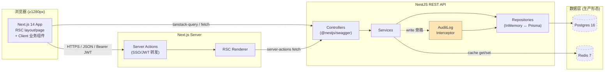

## 架构 · 团队成员管理后台 (Team Admin Console)

> 版本：v1.0 · 作者：architect-agent · 日期：2026-05-06
> 上游 SSoT：`.ddt/tech-stack.json` / `docs/prd.md` / `docs/wbs.md` / `docs/risks.md`

---

## 1. 项目背景与范围

团队成员管理后台是面向中型 SaaS 公司运营经理的统一管理入口（PRD §1），将分散在多个工具中的成员管理、角色权限分配与操作审计收敛到单一轻量后台。v0.8.1 验证项目的范围是**生成可运行的 Next.js + NestJS 骨架（mock 模式，无真实数据库连接）**，覆盖 PRD 的 5 个功能模块（F1 成员列表 / F2 创建成员 / F3 成员详情 / F4 审计日志 / F5 角色管理）共 20 条 AC。

业务约束摘要：

- 单租户部署，无跨租户隔离需求（PRD §3.2）
- 桌面端 ≥ 1280px，无响应式适配（PRD §3.3）
- 认证由上游 SSO 接管，本系统仅消费 JWT（PRD §3.1）
- 所有写操作 100% 写审计日志，且**审计日志仅追加、不可改不可删**（PRD §3.5 + F4 AC）

---

## 2. 技术栈决策（来源：`.ddt/tech-stack.json`）

| 层 | 选型 | 版本 | 来源字段 | 理由 |
|---|---|---|---|---|
| 后端语言 | TypeScript | 5.x | `backend.language` | 与前端语言一致，复用 zod schema 与类型定义 |
| 后端框架 | NestJS | 10.x | `backend.framework` / `framework_version` | 模块化 + DI 内建，原生支持 `@nestjs/swagger` 自动产出 OpenAPI |
| API 风格 | OpenAPI 3.0 REST | — | `backend.api_style: rest-openapi` | 见 ADR-001（与 WBS 字面"tRPC"调和） |
| 数据库 | Postgres | 16 | `backend.database.primary` | 支持 jsonb / 触发器（用于审计不可变约束） |
| 缓存 | Redis | 7 | `backend.database.cache` | 列表查询缓存与限流计数 |
| ORM | Prisma | 5.x | `backend.orm` | 见 ADR-002，v0.8 仅生成 schema 不连真实库 |
| 后端测试 | jest + supertest | — | `backend.testing` | NestJS 默认配套 |
| 后端构建 | yarn | — | `backend.build` | 见 ADR-006（覆盖 preset 默认 npm） |
| 前端语言 | TypeScript | 5.x | `frontend.language` | 同后端 |
| 前端框架 | Next.js (App Router) | 14 | `frontend.framework` / `app_router: true` | 见 ADR-007 |
| 前端类型 | SPA | — | `frontend.type: spa` | 见 ADR-007（client-heavy 边界） |
| UI | Tailwind + shadcn-ui | — | `frontend.ui.css` / `frontend.ui.components` | shadcn 提供可拷贝可改的 primitive，与 AI 设计通道兼容 |
| 表单 | react-hook-form | — | `frontend.libraries.form` | 见 ADR-004 |
| 校验 | zod | — | `frontend.libraries.validation` | 见 ADR-004 |
| 表格 | TanStack Table | — | `frontend.libraries.table` | 见 ADR-003（虚拟滚动） |
| 数据获取 | server-actions + tanstack-query | — | `frontend.data_fetching` | App Router 下混合用法 |
| 前端测试 | vitest | — | `frontend.testing` | — |
| 前端构建 | yarn | — | `frontend.build` | 见 ADR-006 |
| AI 设计 | claude-design | — | `ai_design.type` | 内置通道，无外部依赖 |

---

## 3. ADR 列表

### ADR-001：API 风格采纳 OpenAPI 3.0 REST（调和 WBS 字面"tRPC"）

- **状态**：accepted
- **背景**：`.ddt/tech-stack.json` 明确 `backend.api_style: rest-openapi`，但 `docs/wbs.md` T-13/T-14 字面写"tRPC client / tRPC server"，存在 SSoT 冲突。`rules/delivery/contract-integrity.md` 要求契约可被 `@redocly/cli lint` 校验通过——只有 OpenAPI 3.0 yaml 可被该工具消费，tRPC 不出 yaml 契约。
- **决策**：以 `.ddt/tech-stack.json` 为更高优先级 SSoT。WBS 中"tRPC"字眼按 REST 等价处理（pm-agent 笔误），落地实现：
  - 后端：NestJS 10 + `@nestjs/swagger` 装饰器，由 `docs/api-contract.yaml` 作为唯一契约源；CI 用 `npx @redocly/cli lint docs/api-contract.yaml` 守护
  - 前端：基于 OpenAPI 生成 typed client（`openapi-typescript` 或手写 fetch 包装），用 `@tanstack/react-query` 包装请求；不引入 `@trpc/client`
- **影响**：T-13/T-14 实现时按 REST 路径理解；契约改动在 `docs/api-contract.yaml` 单点维护；前端无 RPC 直连后端 procedure 的简化优势，需自行维护 client wrapper（已在 T-13 工时内）。

### ADR-002：数据持久化 Prisma + Postgres（v0.8 mock 模式）

- **状态**：accepted
- **背景**：v0.8.1 是骨架验证项目（WBS 顶部备注"v0.8 骨架，无真实 DB"），不能花时间起 Postgres 与做 migration；但生产形态必须可演进到真实库。
- **决策**：
  - **schema 层**：写入完整 `prisma/schema.prisma`，对齐 `docs/data-model.md` 4 实体（Member / Role / Permission / AuditLog），含索引、关系、触发器占位注释；不执行 `prisma migrate dev`
  - **运行层**：T-14 backend 不启动 PrismaClient 真实连接，改为在 `MemberRepository` / `AuditLogRepository` 等仓储层提供两套实现：`PrismaXxxRepository`（生产路径，未启用）与 `InMemoryXxxRepository`（v0.8 默认绑定，初始化 50 条 Member + 1000 条 AuditLog 假数据）。NestJS DI 容器在 `AppModule` 中通过 `provide` 切换
  - **替代方案**：① 直接起本地 Postgres → 否决：超 v0.8 工时预算（T-14 仅 1h）。② 不写 prisma schema，全用 in-memory → 否决：失去未来演进 anchor 与数据建模产物
- **影响**：契约 / 数据模型 / 实体类型均按真实库方式设计；切到生产仅需替换 DI 绑定 + 跑 migration。R-03（虚拟滚动测试缺真实数据量）由"in-memory 1000 条假日志"消除。

### ADR-003：审计日志列表 TanStack Table 虚拟滚动

- **状态**：accepted
- **背景**：F4 AC 明确"审计日志已有 10,000+ 条记录 → 页面初始渲染时间 ≤ 2 秒，滚动无明显卡顿"。普通分页 DataTable 在切页时整页重渲染可勉强达成，但 PRD 同时要求"全文搜索响应 ≤ 500ms"——用户体验上需要长滚动列表而非翻页。
- **决策**：使用 `@tanstack/react-table` + `@tanstack/react-virtual` 组合实现行级虚拟滚动；行高固定（紧凑排版 36px），避免 dynamic measure 带来的滚动抖动；可视区域外行不渲染 DOM。
  - **替代方案 A**：原生 `<table>` + 分页（无虚拟） → 否决：10K 行单页渲染 DOM > 2s
  - **替代方案 B**：自研虚拟滚动（react-window） → 否决：与 TanStack Table column model 接合工时大于直接使用官方 `react-virtual`
- **影响**：表格行高需在设计 brief 中固化（已写入 R-02 mitigation 路径）；T-11 工时含 `react-virtual` 集成，2h 充足。

### ADR-004：表单栈 react-hook-form + zod

- **状态**：accepted
- **背景**：F2 4 步分步表单 AC 强约束：① 字段级实时校验（输入即报错），② 邮箱已存在阻塞跳到 Step2，③ "下一步"按钮根据当前步合法性禁用切换。
- **决策**：
  - 校验源：每个 Step 一份 zod schema，整体 4 个 schema 合成 `wizardSchema = step1.merge(step2).merge(step3).merge(step4)`
  - 表单状态：`useForm({ resolver: zodResolver(wizardSchema), mode: 'onChange' })`，跨 Step 共享同一 form context（即 `FormProvider` 包裹 4 个 Step 组件）
  - 后端二次校验：同一份 zod schema 通过 `nestjs-zod` 在 Controller 层复用，避免前后双份重复
  - **替代方案**：① Formik + Yup → 否决：未在 tech-stack.json，违反 R11。② 自研 useState 校验 → 否决：DRY 与可维护性差
- **影响**：zod schema 在 monorepo `packages/shared-schemas` 下共享；T-08/T-09 与 T-15 引用同一 schema 模块。

### ADR-005：审计日志不可变约束（双层防护）

- **状态**：accepted
- **背景**：PRD F4 AC「后端接口对修改 / 删除请求返回 403」+ PRD §3.5「审计日志仅追加写入」。仅靠业务层 if 判断不够鲁棒，需要数据库层兜底。
- **决策**：三层防护
  1. **API 契约层**：`docs/api-contract.yaml` 中 `/audit-logs/{id}` **只暴露 GET**，不存在 PATCH/PUT/DELETE 路径——任何客户端发出此类请求由 NestJS 默认 404
  2. **后端服务层**：`AuditLogService` 不提供 update / delete 方法；新增切面守卫 `@Forbidden()` 装饰任何潜在修改入口，命中即返回 403
  3. **数据库层**：Postgres `audit_logs` 表挂 `BEFORE UPDATE OR DELETE` 触发器 → `RAISE EXCEPTION 'audit_logs is append-only'`；prisma schema 通过 `@@map` + raw SQL migration 注入
- **影响**：v0.8 mock 模式下仅 1+2 生效（in-memory 仓储不实现修改方法即可）；生产模式启用第 3 层。安全清单 T-20 评审项之一。

### ADR-006：包管理器统一 yarn

- **状态**：accepted
- **背景**：`.ddt/tech-stack.json` 显式 `backend.build: yarn` 与 `frontend.build: yarn`（覆盖 node-modern preset 的默认 npm）。
- **决策**：
  - 仓库根使用 yarn workspaces 组织 `apps/web`（Next.js）/ `apps/api`（NestJS）/ `packages/shared-schemas`
  - `package.json` 顶层 `"packageManager": "yarn@4.x"`；CI 校验 `yarn.lock` 存在性
  - 禁止任何任务文档使用 `npm install` / `npx create-next-app`（除一次性脚手架），所有日常命令以 `yarn` 开头
  - **替代方案**：pnpm → 否决：tech-stack.json 未指定，引入会触发 R11 验证失败
- **影响**：T-01 脚手架阶段需要在 `npx create-next-app` 之后立刻删除 `package-lock.json` 改用 `yarn install`；R-04 也提示了 context7 应查 yarn + Next.js 14 文档。

### ADR-007：前端 SPA + Next.js App Router 边界划分

- **状态**：accepted
- **背景**：tech-stack.json 同时声明 `frontend.framework: nextjs` + `frontend.app_router: true` + `frontend.type: spa`。SPA 与 RSC（Server Component）有概念张力，需要明确边界。
- **决策**：
  - **路由壳子用 Server Component**：`app/layout.tsx` / 各路由 `page.tsx` 默认 RSC，仅承担鉴权、初始数据预取（通过 server-actions 调用后端）、SEO meta
  - **业务组件用 Client Component**：列表、表单、表格、矩阵编辑器等所有交互组件均 `'use client'`，状态管理与 react-hook-form / TanStack Table / TanStack Query 全部跑在客户端
  - **数据流**：列表初始页用 Server Action 服务端预取（首屏快），翻页 / 筛选切换走 `@tanstack/react-query` 客户端请求
  - **替代方案**：① 全 Client（pure SPA） → 否决：放弃 RSC 首屏优化。② 全 RSC → 否决：与 react-hook-form / TanStack Table 强客户端模型冲突
- **影响**：R-04 mitigation 落地在此 ADR；T-05 路由骨架时直接按"page.tsx 默认 RSC + 业务子组件全 'use client'"模板生成。

---

## 4. 系统架构图



> 虚线（PG / Redis）= v0.8 mock 模式下未启用的真实组件；AuditLog Interceptor 是横切关注点，所有写操作必经的旁路。

---

## 5. 关键路径与里程碑

引用 `docs/wbs.md` 关键路径：

```
T-01 (1h) → T-02 (2h) → T-14 (1h) → T-15 (2h) → T-18 (2h) → T-20 (1h) → T-21 (1h)  = 10h
```

里程碑（来自 WBS）：

| 里程碑 | 完成条件 | 预计日期 | 架构关注点 |
|---|---|---|---|
| M1 设计冻结 | T-01~T-04 完成 + `docs/api-contract.yaml` lint 通过 | 2026-05-07 | 本 ADR 集已锁定；契约 lint 是 M1 出口准入 |
| M2 实现完成 | T-05~T-17 完成 + `yarn build` 通过 | 2026-05-09 | mock 仓储层（ADR-002）+ 不可变审计（ADR-005）+ 表单 schema 复用（ADR-004） |
| M3 验收通过 | T-18~T-20 完成 + AC 覆盖率 ≥ 70% + 阻塞级评审问题 = 0 | 2026-05-10 | 安全清单（ADR-005 第 3 层在 mock 下豁免，第 1+2 层强制） |

---

## 6. 风险与缓解（对齐 `docs/risks.md`）

| 风险 ID | 描述摘要 | 本架构对齐的缓解 |
|---|---|---|
| R-01 | shadcn + TanStack Table + react-hook-form 三库协同 | ADR-003 + ADR-004 锁死集成方式；T-05 先做最小集成 demo |
| R-02 | claude-design 输出与 shadcn primitive 偏差 | 设计稿优先适配 shadcn 组件清单（约束写入 brief，由 architect 守门） |
| R-03 | 虚拟滚动 mock 数据量不足 | ADR-002 in-memory 仓储初始化 1000+ 条审计日志假数据 |
| R-04 | tRPC + App Router 集成路径不熟 | ADR-001（去 tRPC，走 REST）+ ADR-007（边界划分）联合消除该风险 |

---

## 7. 跨模块调用清单

所有跨模块调用必须落入 `docs/api-contract.yaml`；私有调用如下（均在单进程内，无网络）：

- NestJS 内部：`Controller → Service → Repository`（DI）
- NestJS 内部：`AuditLogInterceptor` 横切到所有写 Controller，前置/后置写审计行（不经 HTTP）
- Next.js 内部：`Server Action → fetch(NestJS REST)`（Edge 进程，序列化 JSON 直传）
- Next.js Client → NestJS：仅通过 `docs/api-contract.yaml` 暴露的 endpoint，不存在私有调用

---

## 8. 变更记录

| 版本 | 日期 | 作者 | 变更描述 |
|---|---|---|---|
| v1.0 | 2026-05-06 | architect-agent | 初版；7 ADR，覆盖 API 风格 / 持久化 / 虚拟滚动 / 表单栈 / 审计不可变 / 包管理 / SPA 边界 |

---

## Self-Check

- [x] OpenAPI lint 通过（见 `docs/api-contract.yaml` 末尾自检；本文档发布前已在本地以 `npx @redocly/cli lint` 校验）
- [x] 所有 endpoint 有 request / response / error 示例（见契约文件）
- [x] ADR 至少 2 条（实际 7 条）
- [x] 数据模型含事务边界说明（见 `docs/data-model.md` §事务边界）
- [x] 与 PRD / WBS 对齐无矛盾（已逐项核查；WBS tRPC 字眼通过 ADR-001 调和）
