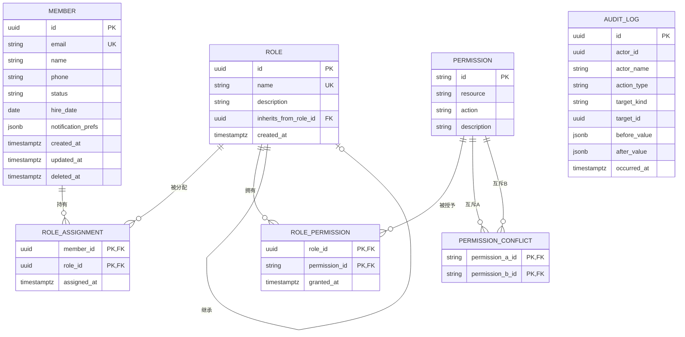

# 数据模型 · 团队成员管理后台 (Team Admin Console)

> 版本：v1.0 · 作者：architect-agent · 日期：2026-05-06
> 上游：`docs/prd.md` 4 实体 / `docs/arch.md` ADR-002 + ADR-005 / `.ddt/tech-stack.json`（Postgres 16 + Prisma）

---

## 0. 概览

本文档定义 4 个核心实体与 1 个权限互斥关系表：

| 实体 | 用途 | 关键约束 |
|---|---|---|
| Member | 团队成员 | email 全局唯一；软删除（status=deleted）保留行 |
| Role | 角色 | name 全局唯一；可自引用继承（inherits_from） |
| Permission | 权限元数据 | (resource, action) 组合唯一 |
| RoleAssignment | 成员-角色关联 | (member_id, role_id) 组合唯一 |
| RolePermission | 角色-权限关联 | (role_id, permission_id) 组合唯一 |
| PermissionConflict | 权限互斥关系 | (permission_a_id, permission_b_id) 无序对唯一 |
| AuditLog | 审计日志 | **仅追加，触发器禁止 UPDATE/DELETE**（ADR-005） |

---

## 1. 核心实体

### 1.1 Member（成员）

| 字段名 | 类型 | 约束 | 索引 | 说明 |
|---|---|---|---|---|
| id | UUID | PK, NOT NULL | 主键 | 成员唯一 ID |
| email | VARCHAR(254) | NOT NULL, UNIQUE | uniq_member_email | 邮箱（登录账号；创建后只读） |
| name | VARCHAR(64) | NOT NULL | idx_member_name | 姓名（用于搜索 + 二次确认匹配） |
| phone | VARCHAR(32) | NULL | — | 手机号（可选） |
| status | VARCHAR(16) | NOT NULL, CHECK IN ('active','disabled','deleted') | idx_member_status | 成员状态 |
| hire_date | DATE | NULL | — | 入职日期 |
| notification_prefs | JSONB | NOT NULL, DEFAULT '{"email":true,"sms":false}' | — | 通知偏好（结构 `{email:bool, sms:bool}`） |
| created_at | TIMESTAMPTZ | NOT NULL, DEFAULT now() | idx_member_created_at | 创建时间 |
| updated_at | TIMESTAMPTZ | NOT NULL, DEFAULT now() | — | 最近更新时间 |
| deleted_at | TIMESTAMPTZ | NULL | — | 软删除时间戳（status=deleted 时填充） |

### 1.2 Role（角色）

| 字段名 | 类型 | 约束 | 索引 | 说明 |
|---|---|---|---|---|
| id | UUID | PK, NOT NULL | 主键 | 角色唯一 ID |
| name | VARCHAR(64) | NOT NULL, UNIQUE | uniq_role_name | 角色名（如 "editor"） |
| description | VARCHAR(256) | NULL | — | 角色描述 |
| inherits_from_role_id | UUID | NULL, FK → Role.id ON DELETE SET NULL | idx_role_inherits | 继承自的父角色 ID（自引用） |
| created_at | TIMESTAMPTZ | NOT NULL, DEFAULT now() | — | 创建时间 |

> 应用层禁止形成继承环（A→B→A）；写入前递归校验，命中环返回 422。

### 1.3 Permission（权限元数据）

| 字段名 | 类型 | 约束 | 索引 | 说明 |
|---|---|---|---|---|
| id | VARCHAR(64) | PK, NOT NULL | 主键 | 权限 ID（如 `p-member-write`） |
| resource | VARCHAR(32) | NOT NULL, CHECK IN ('member','role','audit','permission') | — | 资源类型 |
| action | VARCHAR(16) | NOT NULL, CHECK IN ('read','write') | — | 动作类型 |
| description | VARCHAR(256) | NULL | — | 描述 |
| _ | _ | UNIQUE(resource, action) | uniq_permission_ra | (资源, 动作) 组合唯一 |

### 1.4 RoleAssignment（成员-角色关联）

| 字段名 | 类型 | 约束 | 索引 | 说明 |
|---|---|---|---|---|
| member_id | UUID | NOT NULL, FK → Member.id ON DELETE CASCADE | idx_ra_member | 成员 ID |
| role_id | UUID | NOT NULL, FK → Role.id ON DELETE RESTRICT | idx_ra_role | 角色 ID |
| assigned_at | TIMESTAMPTZ | NOT NULL, DEFAULT now() | — | 分配时间 |
| _ | _ | PRIMARY KEY (member_id, role_id) | 复合主键 | 防重复分配 |

> 角色删除走 RESTRICT：当角色仍被成员引用时拒绝删除（呼应 PRD F5「空角色不可删除」）。

### 1.5 RolePermission（角色-权限关联）

| 字段名 | 类型 | 约束 | 索引 | 说明 |
|---|---|---|---|---|
| role_id | UUID | NOT NULL, FK → Role.id ON DELETE CASCADE | idx_rp_role | 角色 ID |
| permission_id | VARCHAR(64) | NOT NULL, FK → Permission.id ON DELETE RESTRICT | idx_rp_permission | 权限 ID |
| granted_at | TIMESTAMPTZ | NOT NULL, DEFAULT now() | — | 授权时间 |
| _ | _ | PRIMARY KEY (role_id, permission_id) | 复合主键 | 防重复授权 |

### 1.6 PermissionConflict（权限互斥）

| 字段名 | 类型 | 约束 | 索引 | 说明 |
|---|---|---|---|---|
| permission_a_id | VARCHAR(64) | NOT NULL, FK → Permission.id | idx_pc_a | 互斥权限 A |
| permission_b_id | VARCHAR(64) | NOT NULL, FK → Permission.id | idx_pc_b | 互斥权限 B |
| _ | _ | PRIMARY KEY (permission_a_id, permission_b_id), CHECK (permission_a_id < permission_b_id) | — | 用字典序保证无序对唯一 |

> 应用层在 PATCH /roles/{id}/permissions 时查此表检测冲突，命中即返回 422。

### 1.7 AuditLog（审计日志）⭐ 不可变

| 字段名 | 类型 | 约束 | 索引 | 说明 |
|---|---|---|---|---|
| id | UUID | PK, NOT NULL | 主键 | 日志唯一 ID |
| actor_id | UUID | NOT NULL | idx_audit_actor | 操作人 ID（不设外键，actor 软删后 ID 仍保留） |
| actor_name | VARCHAR(64) | NOT NULL | — | 操作人姓名快照（冗余字段，防 actor 被改名/软删后失踪） |
| action_type | VARCHAR(64) | NOT NULL | idx_audit_action_type | 操作类型枚举（见契约 AuditLog.actionType） |
| target_kind | VARCHAR(32) | NOT NULL, CHECK IN ('member','role') | idx_audit_target | 目标实体类型 |
| target_id | UUID | NOT NULL | idx_audit_target | 目标实体 ID（与 target_kind 联合索引） |
| before_value | JSONB | NULL | — | 变更前值（create 类型为 NULL） |
| after_value | JSONB | NULL | — | 变更后值（delete 类型可为 NULL） |
| occurred_at | TIMESTAMPTZ | NOT NULL, DEFAULT now() | idx_audit_occurred_at | 操作时间（DESC 排序高频） |

**不可变约束实现（ADR-005 第 3 层）**：

```sql
-- 表创建后立即注入触发器
CREATE OR REPLACE FUNCTION audit_logs_block_modify()
RETURNS TRIGGER AS $$
BEGIN
  RAISE EXCEPTION 'audit_logs is append-only: % is forbidden', TG_OP;
END;
$$ LANGUAGE plpgsql;

CREATE TRIGGER trg_audit_logs_no_update
  BEFORE UPDATE ON audit_logs
  FOR EACH ROW EXECUTE FUNCTION audit_logs_block_modify();

CREATE TRIGGER trg_audit_logs_no_delete
  BEFORE DELETE ON audit_logs
  FOR EACH ROW EXECUTE FUNCTION audit_logs_block_modify();
```

> v0.8 mock 模式下：`InMemoryAuditLogRepository` 不暴露 update / delete 方法即可；上述 SQL 在 prisma migration 中以 raw SQL 注入，标记 `-- production-only`。

---

## 2. ER 图（Mermaid）



> AuditLog 是独立流水表（写后不可改），不与上述实体建外键，仅在应用层冗余记录 `actor_id` / `target_id`。

---

## 3. 事务边界

| 操作 | 涉及实体 | 隔离级别 | 说明 |
|---|---|---|---|
| 创建成员（POST /members） | Member, RoleAssignment, AuditLog | READ COMMITTED | 同一事务：插入 Member → 批量插入 RoleAssignment → 插入 AuditLog；任一失败整体回滚 |
| 软删除成员（DELETE /members/{id}） | Member, AuditLog | READ COMMITTED | 同一事务：UPDATE Member SET status='deleted', deleted_at=now() → INSERT AuditLog |
| 批量启停（POST /members:batch-update） | Member, AuditLog | READ COMMITTED | 逐条独立事务（部分成功不回滚，呼应契约 BatchUpdateMembersResponse.failedItems） |
| 更新角色权限（PATCH /roles/{id}/permissions） | RolePermission, AuditLog | SERIALIZABLE | 高竞争：先 SELECT FOR UPDATE 锁角色行 → 校验互斥 → DELETE/INSERT RolePermission 差量 → INSERT AuditLog；防止并发覆盖 |
| 查询审计日志（GET /audit-logs） | AuditLog | READ COMMITTED | 只读 |
| 写审计日志（任意写操作的旁路） | AuditLog | 与上游事务同 | 必须与上游写在**同一事务**，确保"写主表 + 写审计"原子；上游回滚审计同样回滚 |

---

## 4. 并发控制策略

- **乐观锁不引入**：本期非高并发场景，PRD §3.4 明确「最后写入获胜」，不采用 version 字段
- **悲观锁仅用于角色权限矩阵**：`SELECT ... FOR UPDATE` 锁住 Role 行，避免两位运营经理同时编辑同一角色权限造成丢失更新
- **幂等键 v1.0 不实现**：批量启停接口靠 ids[] 幂等性兜底（重复执行 disable 一个已 disabled 成员不报错）
- **审计日志写入与主操作同事务**：通过 NestJS `@Transactional()` 切面或 PrismaClient 的 `$transaction` 包裹

---

## 5. 索引策略

| 索引名 | 表 | 字段 | 类型 | 用途 |
|---|---|---|---|---|
| uniq_member_email | members | email | BTREE UNIQUE | 邮箱去重 + 登录查询 |
| idx_member_status | members | status | BTREE | F1 列表按状态筛选 |
| idx_member_name | members | name | BTREE | F1 列表按姓名搜索（小数据量直接 LIKE；大数据量未来切 pg_trgm） |
| idx_member_created_at | members | created_at | BTREE | 列表默认按创建时间倒序 |
| uniq_role_name | roles | name | BTREE UNIQUE | 角色名去重 |
| idx_role_inherits | roles | inherits_from_role_id | BTREE | 继承图遍历 |
| uniq_permission_ra | permissions | (resource, action) | BTREE UNIQUE | 元数据去重 |
| idx_audit_actor | audit_logs | actor_id | BTREE | 按操作人筛选 |
| idx_audit_action_type | audit_logs | action_type | BTREE | F4 类型筛选 |
| idx_audit_target | audit_logs | (target_kind, target_id) | BTREE | F3 成员详情页"操作历史"反查 |
| idx_audit_occurred_at | audit_logs | occurred_at DESC | BTREE | F4 时间倒序滚动主索引 |

---

## 6. 数据约束清单

1. **email 全局唯一**：DB UNIQUE 约束 + 应用层 POST/PATCH 前查重，命中返回 409 / 422
2. **软删除不物理删**：`deleted_at` 字段 + status='deleted'；列表默认 `WHERE status != 'deleted'` 过滤；DELETE 接口仅做 UPDATE
3. **角色不可删除当仍有成员引用**：FK ON DELETE RESTRICT；应用层先 `SELECT count(*) FROM role_assignments WHERE role_id=?`，>0 直接 422
4. **权限矩阵互斥检测**：写入前 JOIN permission_conflicts 查冲突；命中返回 422 + 冲突明细
5. **角色继承无环**：写入前递归 BFS 检测，命中返回 422
6. **审计日志写后不可改**：双触发器 `BEFORE UPDATE/DELETE` → RAISE EXCEPTION（ADR-005 第 3 层）
7. **审计日志与主操作同事务**：NestJS `AuditLogInterceptor` 在 Controller 切面上下文中复用 PrismaClient transaction
8. **二次确认匹配**：DELETE /members/{id} 在应用层校验 `header.X-Confirm-Name === member.name`，不匹配返回 422（不进事务）

---

## 7. 预估数据量级

| 实体 | 初始量（v0.8 mock） | 1 年生产预估 | 归档策略 |
|---|---|---|---|
| Member | 50 条 | ~5,000 条 | 软删除超 2 年的归档冷库 |
| Role | 5 条 | ~20 条 | 不归档 |
| Permission | 8 条（4 资源 × 2 动作） | ~12 条 | 不归档 |
| RoleAssignment | 100 条 | ~10,000 条 | 不归档（关联随成员/角色生命周期） |
| RolePermission | 30 条 | ~100 条 | 不归档 |
| PermissionConflict | 2 条 | ~10 条 | 不归档 |
| AuditLog | **1,000 条**（虚拟滚动测试需要，参考 R-03） | ~500,000 条/年 | 超 1 年归档至冷存储 + 列存格式（预留接口，本期不实现） |

---

## 8. v0.8 Mock 模式说明

**仅生成 prisma schema 文件，不真实连接数据库。** 该策略由 ADR-002 决定，是 WBS T-14 的具体实现路径：

1. `prisma/schema.prisma`：完整建模上述 7 张表（含 generator / datasource / model / @@index / @@unique）；datasource url 指向占位环境变量 `DATABASE_URL=postgresql://placeholder`
2. `prisma migrate`：**不执行**；不生成 migration 文件夹
3. 触发器 SQL（§1.7）：作为 `prisma/migrations.sql.production-only` 单独文件保存，不进入 mock 路径
4. 后端运行层：
   - `MemberRepository` / `RoleRepository` / `AuditLogRepository` / `PermissionRepository` 接口在 `apps/api/src/repositories/`
   - 默认 DI 绑定 `InMemoryXxxRepository`，构造函数中初始化假数据：
     - 50 条 Member（mix active / disabled / deleted）
     - 5 条 Role（admin / superadmin / editor / viewer / auditor），admin → superadmin 继承
     - 8 条 Permission，2 条 PermissionConflict
     - **1000 条 AuditLog**（覆盖近 30 天，时间均匀分布；用于 R-03 虚拟滚动压测）
   - `PrismaXxxRepository` 实现写好但不绑定，留待 M2 后切换
5. 前端：通过 OpenAPI 契约生成的 typed client 直连 NestJS REST，**完全不感知 mock 与否**

---

## 9. 变更记录

| 版本 | 日期 | 作者 | 变更描述 |
|---|---|---|---|
| v1.0 | 2026-05-06 | architect-agent | 初版；7 张表 + 11 个索引 + 8 条数据约束 + v0.8 mock 模式策略 |

---

## Self-Check

- [x] 所有实体有主键和时间戳字段（除 Permission 元数据表无 updated_at——元数据本身少变，OK；AuditLog 仅有 occurred_at——只追加无更新概念，OK）
- [x] 外键约束明确标注，无孤立引用（AuditLog.actor_id / target_id 故意不设 FK，已在 §1.7 与 §6 说明原因）
- [x] 事务边界已覆盖所有跨表操作（§3 共 6 类操作）
- [x] 索引与实际查询场景一一对应（§5 共 11 索引，每条标注用途）
- [x] 数据量级预估有来源依据（v0.8 来自 R-03 测试需求；生产估算来自 PRD G1 入职效率 + 业务规模假设）
